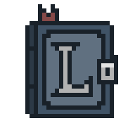

<div align="center">



# The Librarium

### A local LLM chat orchestrator for Obsidian powered by Ollama

<p>
  Give your local AI persistent, scalable memory through hierarchical context retrieval.
</p>

<a href="https://ko-fi.com/natthapolmnc">
  
</a>

</div>

---

**The Librarium** is a local-LLM chat orchestrator for [Obsidian](https://obsidian.md), backed by [Ollama](https://ollama.com). It keeps topic-separated memory as a fixed stack of progressively more detailed layers — from a quick Overview down to a Comprehensive Summary, plus the raw Original — routes each chat query to only the relevant topics, and searches that layer stack starting from the least detail, loading more only when it's actually needed.

Everything runs locally against your own Ollama models: no cloud API, no data leaving your machine.

## Contents

- [Installation](#installation)
- [Tested Configuration](#tested-configuration)
- [Recommended Configuration](#recommended-configuration)
- [How it works](#how-it-works)
- [Memory layers](#memory-layers)
- [Routing: how a query finds the right memories](#routing-how-a-query-finds-the-right-memories)
- [Note-memory](#note-memory-a-third-memory-type-one-per-note)
- [Chat history digest](#chat-history-digest-keeping-long-chats-grounded-without-resending-everything)
- [Chat interface](#chat-interface)
- [Cancellation: what it actually does](#cancellation-what-it-actually-does)
- [Known limitations](#known-limitations)
- [Support The Librarium](#️-support-the-librarium)
- [License](#license)

## Installation

### 1. Install Obsidian

The Librarium is an Obsidian plugin, so you need Obsidian installed first:

1. Download Obsidian for your OS from **[obsidian.md/download](https://obsidian.md/download)** and install it.
2. Open Obsidian and either create a new vault or open an existing one.

### 2. Install Ollama and pull your models

The Librarium doesn't call any model itself — it talks to a local Ollama server for chat, summarization, and embeddings.

1. Download and install Ollama from **[ollama.com](https://ollama.com)** (macOS, Windows, and Linux are all supported).
2. Confirm it's running — by default it serves at `http://localhost:11434`.
3. Pull the models you plan to use, for example:

   ```bash
   ollama pull gemma4:e4b          # chat model
   ollama pull nomic-embed-text  # embedding model
   ```

   The **chat** and **summary** models must support `chat`/`generate`. The **embedding** model must be an embeddings-only model (e.g. `nomic-embed-text`) — it cannot be used for chat, and a chat model can't be used for embeddings. Mixing these up is the most common source of 404/500 errors (see [Known limitations](#known-limitations)).

### 3. Install the plugin

```bash
npm install
npm run build        # type-checks then bundles src/ -> main.js
```

Copy `manifest.json`, `main.js`, and `styles.css` into:

```
<vault>/.obsidian/plugins/the-librarium/
```

Then enable it from **Settings → Community plugins** in Obsidian, open the plugin's settings tab, point it at your Ollama models, and use the **"Test connection"** button to confirm all three models are reachable and correctly configured.

`npm run dev` runs esbuild in watch mode while you iterate on the source.

## Tested Configuration

The Librarium has been primarily developed and tested using the following environment. Other configurations should work, but performance and throughput may vary depending on the selected models and hardware.

### Hardware

| Component        | Specification                    |
| ---------------- | -------------------------------- |
| CPU              | AMD Ryzen 7 7800X3D              |
| GPU              | NVIDIA GeForce RTX 5060 Ti 16 GB |
| RAM              | 32 GB                            |
| Operating System | Windows 11 Pro                   |

### Ollama Models

| Purpose       | Model              |
| ------------- | ------------------ |
| Chat          | `gemma4:e4b`       |
| Summarization | `gemma4:e4b`       |
| Embeddings    | `nomic-embed-text` |

### Plugin Configuration

The default configuration were used for development and testing:

```ts
	ollamaBaseUrl: "http://localhost:11434",
	chatModel: "gemma4:e4b",
	summaryModel: "gemma4:e4b",
	embeddingModel: "nomic-embed-text",

	memoriesFolder: "librarium",
	tempMemoryFolder: "librarium/temp-memory",
	noteMemoryFolder: "librarium/notes",
	autoInitNoteMemory: true,
	maxMemoriesPerQuery: 3,
	routingMethod: "hybrid",
	suggestMemoryUpdates: true,
	enableClarification: true,
	similarityThreshold: 0.55,

	maxChunkMergePasses: 4,
	maxConcurrentSummaries: 4,
	mergeGroupMaxChars: 20000,
	mergeOverlapUnits: 1,

	numAbstractionLayers: 3,

	enableIntentExtraction: true,

	trackChatSummary: true,
	recentRawTurns: 12,

	debugLogging: false,
```

### Notes

These settings are intended as a balanced default for local inference. Users with more powerful hardware may benefit from increasing `maxConcurrentSummaries`, while lower-memory systems may prefer reducing concurrency or selecting a smaller chat model.

## Recommended Configuration

The tested defaults above are a reasonable starting point for a mid-range single-GPU machine running a small-to-mid chat model. Beyond that baseline, a few settings are worth tuning deliberately depending on your hardware and how you actually use the plugin — each adds cost (an extra LLM call, a bigger context window, or more concurrent requests) in exchange for a specific benefit, so there's no single "best" value for everyone.

| Setting | Trade-off | Recommendation |
| --- | --- | --- |
| `maxConcurrentSummaries` | More parallel requests to Ollama = faster builds, but higher peak VRAM/CPU load | Keep the default (4) on the tested hardware class above. Drop to 1–2 on integrated GPUs or CPU-only inference; raise to 6–8 only if you have a larger/multiple GPU(s) and see Ollama comfortably keeping up. |
| `numAbstractionLayers` | More layers = finer-grained control over how much detail gets pulled in, but a longer build/extend chain per topic | 3 (default) is a good general middle ground. Drop to 1–2 for mostly short, simple notes where an Overview vs. Comprehensive Summary split is already enough. Raise it only for large, dense source documents where you actually want a mid-tier "just enough detail" layer. |
| `routingMethod` | `llm` is most accurate but doesn't scale; `embedding` scales but is a blunter match; `hybrid` balances both at the cost of needing a working embedding model | Use `hybrid` (default) once you have more than a handful of topics. `llm` is fine and slightly more accurate below ~20 topics. Fall back to `embedding` only if your embedding model is unreliable or you want to skip the LLM re-rank call entirely. |
| `enableIntentExtraction` / `enableClarification` | Each is one extra small-model call per query, in exchange for sharper retrieval and fewer wrong-context answers | Leave both on with a fast `summaryModel` (they're cheap relative to the main chat call). If you're on CPU-only inference and every round trip is expensive, turn `enableClarification` off first — it matters most for ambiguous, personal-context questions, less for self-contained ones. |
| `suggestMemoryUpdates` | Surfaces candidate facts to confirm/discard — change-aware, so it only re-surfaces a topic when something's actually new or different | Leave on. It only stages something when it's judged genuinely new or changed relative to what's already remembered or already pending, so it shouldn't get noisy even in long chats. |
| `trackChatSummary` | One extra small-model call per turn, in exchange for the model staying aware of earlier turns without re-sending the whole transcript | Leave on for any chat you expect to run more than a few turns — it's what keeps later replies grounded once `recentRawTurns` starts trimming the raw transcript. Turn it off only for short, one-off Q&A sessions where the extra call isn't worth it. |
| `recentRawTurns` | Smaller = cheaper/faster per-turn context, larger = more exact verbatim recall of recent wording | 12 (default) suits a typical 8K–32K-context chat model. Lower it to 6–8 for smaller-context or slower models once `trackChatSummary` is on, since the summary picks up the slack. Raise it if your chat model has a large context window and you'd rather over-provide raw context than rely on the summary's compression. |

Three other things worth calling out explicitly:
- **Raw-text chunking is no longer a tunable setting.** Earlier versions split source text mechanically on a character/sentence ceiling (`chunkMaxChars` / `chunkMaxSentences`). That's gone — `src/chunker.ts` now asks the LLM to mark natural break points (topic shifts, scene/section boundaries) instead, so there's nothing to configure here. The only ceiling left is an internal, non-configurable input-size limit that exists purely to keep a single chunking call within the model's context window.
- **Model split matters more than any single setting above.** Using the same model for `chatModel` and `summaryModel` (as in the tested config) is simplest and works well if that model is fast enough; if it isn't, pointing `summaryModel` at a smaller/faster model than `chatModel` is usually the single highest-leverage change, since `summaryModel` is what pays for routing, intent extraction, ambiguity checks, memory-command detection, the chat-history digest, and every layer build/extend.
- **Hardware headroom, not just VRAM size, should drive concurrency.** `maxConcurrentSummaries` is the one setting most directly tied to your specific machine rather than to how you use the plugin — when in doubt, start low, watch Ollama's own load, and raise it incrementally rather than guessing from GPU memory alone.

## How it works

The Librarium maps onto five building blocks:

**1. Layered memory** — `src/memoryStore.ts`. Each topic is a main note (Overview + links) plus a companion folder with one file per deeper layer and the raw Original. Everything is always derived from the topic's `LayeredMemory` — never written by hand — whether the topic came from an ingested file or purely from chat-derived facts. The `LayeredMemory` itself lives in the plugin's `data.json`; the vault files are always regenerated from it.

**2. Routing** — `src/memoryRouter.ts`. On every chat query, `routeMemories()` looks at all topic overviews and picks the relevant ones, capped by the adjustable **Max memories per query** setting. See [Routing](#routing-how-a-query-finds-the-right-memories) below.

**3. File reading/writing** — `src/fileSkills.ts`. A thin wrapper around the vault API (read/write/append/list) used by the orchestrator and any future commands.

**4. Progressive abstraction** — `src/summarizer.ts`. Every memory is a fixed, named stack of layers, built bottom-up so each one is a faithful, non-hallucinated abstraction of the layer below it. See [Memory layers](#memory-layers).

**5. Chat history digest** — `src/chatHistoryStore.ts`. Each chat session keeps a rolling summary of the conversation plus the model's current best read of what the user is trying to accomplish, updated with one small-model call per turn instead of re-reading the whole transcript. See [Chat history digest](#chat-history-digest-keeping-long-chats-grounded-without-resending-everything) below.

Everything the plugin creates lives under one top-level vault folder (`librarium` by default, changeable in settings):
- `librarium/` — confirmed, permanent memory-topic files: a main note per topic plus a same-named companion folder.
- `librarium/temp-memory/` — pending, unconfirmed candidates, shown as Save/Discard cards in chat before anything is written to permanent memory.
- `librarium/notes/` — per-note layered mirrors (note-memory).

The chat-history digest is the one exception to "everything lives in the vault": it's pure scratch context for the model, never shown to the user and never written as a note, so it lives only in the plugin's `data.json` alongside the `LayeredMemory` data.

## Memory layers

| Layer | Name | Contains |
|---|---|---|
| 0 (top) | Overview | a few sentences giving a quick understanding |
| 1 | High-Level Concepts | main ideas, themes, and relationships |
| 2 | Detailed Concepts | specific explanations, important details, supporting context |
| 3 (base) | Comprehensive Summary | near-complete, preserves most of the original information |
| — | Original | the complete, unmodified source text |

The number of layers is configurable (`numAbstractionLayers`, default 3). Build order runs bottom-up: the Comprehensive Summary is built directly from the source (chunked, then read carefully and merged if it doesn't fit in one chunk); every layer above it is produced by compressing the layer directly below, and is explicitly forbidden from introducing information that isn't already there. At query time, resolution starts at the Overview and only descends into more detail if the current layer is judged insufficient, falling through to the raw Original only as an absolute last resort.

When a topic grows (a new fact from chat, or another file merged in), `extendLayeredMemory()` builds a summary of just the new text, merges it into the existing Comprehensive Summary, and recascades every layer above it — so growth cost stays proportional to the (much smaller) Comprehensive Summary rather than the full raw history.

Before creating a new topic, the orchestrator also checks (via a cheap embedding pass, with an LLM tiebreaker for borderline matches) whether the new content actually belongs under an existing topic, so near-duplicate topics don't fragment your memory.

## Routing: how a query finds the right memories

A query is first routed to a shortlist of topics (`routeMemories()`), using one of three strategies (set in the settings tab):

- **`llm`** — shows the model every topic overview and asks it to pick ids. Most flexible; costs one generation call; doesn't scale well past ~50–100 topics.
- **`embedding`** — cosine similarity between the query and each topic's overview embedding. Scales to many topics, cheap, no LLM round trip.
- **`hybrid`** (default) — embeddings shortlist ~2x the cap, then the LLM re-ranks/filters that shortlist. Good balance once your topic count grows.

Resolving *how much detail* to pull from the routed topics is then done as **one joint, layer-by-layer search across all of them together** (`resolveAcrossSources()` in `src/hierarchicalQuery.ts`), not by resolving each topic independently:

1. Every routed topic starts at layer 0 (its Overview).
2. One batched LLM call looks at all of them together for the current tier and gives each a verdict: `irrelevant` (dropped, deeper layers never fetched), `sufficient` (this cheap layer is kept as-is), or `descend` (relevant, but needs the next, more detailed layer of *that* topic).
3. Only topics marked `descend` continue into the next layer, together, in the same kind of batched call — down to the Comprehensive Summary and, only if still insufficient, the raw Original.

This means total LLM calls scale with **layer depth** (`numAbstractionLayers`), not with how many topics were routed — irrelevant topics never cost more than the price of their Overview.

### How the current note is resolved

The currently open note (when "Include current note" is on, or the query says "this note"/"the current note") is **not** folded into the batched search above — it's resolved on its own via `resolveFromLayers()`. This is deliberate: the user explicitly asked for that note, so it shouldn't be silently dropped by a relevance verdict the way a routed topic can be.

`resolveFromLayers()` makes **one LLM call** regardless of `numAbstractionLayers`: the model is shown every layer of the note at once (Overview through Comprehensive Summary, each with its full text) plus the query and its distilled intent, and picks the lowest-detail layer that's sufficient — or answers `need_original` if none of the named layers are enough, which pulls in the raw Original text. Only that one selected layer (or the Original) is then loaded into the chat context; the others were only ever shown as summaries for the model to choose from. This keeps a query that includes the current note to one extra round trip on top of intent extraction, topic routing, the topic search, and the final chat call — not one round trip per layer.

## Note-memory: a third memory type, one per note

`src/noteMemoryStore.ts` is distinct from both permanent topics and temp-memory: a 1:1 layered mirror of a single note, stored the same way as a topic (a main mirror note plus a companion folder of layer files). The first time a note is referenced in chat, its mirror is built automatically (`autoInitNoteMemory`, on by default), and a query resolves against that layered memory instead of dumping the note's full raw text every time.

A mirror is never refreshed automatically after that first build — you do it explicitly: the toolbar's build/rebuild note-memory button (see [Chat interface](#chat-interface)) handles whatever note is open; **"Refresh (full)"** / **"Update (incremental)"** appear under an answer that used one; the same two actions are also available from the command palette. Incremental update diffs the note against what was last synced: a clean append only summarizes and merges the new suffix; an edit in the middle falls back to a full rebuild.

## Chat history digest: keeping long chats grounded without resending everything

Every chat session (`src/chatHistoryStore.ts`) keeps a `SessionSummary` — a compact narrative of the conversation so far, plus the model's current best read of what the user is overall trying to accomplish in that chat — updated with **one merge call per turn** (previous digest + this turn → new digest), the same incremental pattern `extendLayeredMemory()` uses for topic memories. It's pure scratch context: never shown in the chat UI, never written to the vault, and cleared automatically when a session is deleted or pruned.

This digest does two things once a session has more than a couple of turns:

1. **Feeds earlier-turn awareness into the small supporting calls** — memory-command detection (`detectMemoryCommand`), query-intent extraction (`extractQueryIntent`), and the ambiguity check (`checkAmbiguity`) all see it, not just the last handful of raw messages, so pronoun resolution and "is this ambiguous?" judgments stay grounded even deep into a long chat.
2. **Caps the raw transcript sent to the chat model** — once a digest exists, only the most recent `recentRawTurns` messages are sent verbatim; older turns are represented only by the summary. This keeps per-turn cost roughly flat as a chat grows instead of paying for the entire transcript on every single message.

Both behaviors are controlled from the settings tab: **Track chat summary** (on by default) toggles the whole feature, and **Recent raw turns to include verbatim** (default 12) controls the cap. Turning the toggle off falls back to sending the full raw transcript every time, same as before this feature existed.

## Chat interface

The chat panel (`src/chatView.ts`) has:

- **New chat** — a draft session, invisible in history and never persisted unless you actually send a message in it.
- **History** — a list of saved chats (title, relative time, delete), auto-titled from your first message.
- **Clear temp-memory** — resets the current session's pending notes without starting over.
- **Build/Rebuild note memory** — one toolbar button that builds the hierarchical mirror for the note currently open, or rebuilds it if a mirror already exists; its icon and label ("Build note memory for…" vs. "Rebuild note memory for… (already built)") update on hover to reflect which. Runs with a live step-by-step trace in the chat log.
- **Include current note** (on by default) — also auto-triggers if your question says "this note"/"the current note" even with the toggle off.
- A send button that turns into **Cancel** while a request is in flight, plus a **Retry** button if a send fails outright.

Answers render through Obsidian's own markdown renderer (headings, lists, code blocks, links), have a hover-to-reveal copy button, and the panel auto-scrolls to new messages only when you're already near the bottom.

## Cancellation: what it actually does

Obsidian's `requestUrl` (what `src/ollamaClient.ts` uses to talk to Ollama) has no abort/signal support, so Cancel here is **cooperative, not a true abort**: a `CancellationToken` is checked between discrete steps of a multi-step operation, and everywhere a chat turn, a memory build, or a search touches a checkpoint, it stops before starting the next step.

Concretely, clicking Cancel stops queuing new work immediately and discards whatever single call was already in flight the moment it returns, rather than showing or recording it. This feels close to instant for anything with many small steps (a Comprehensive Summary built from a dozen chunks, a multi-round memory search). Cancelling right as the final chat response is being generated is the one case where you still wait roughly as long as that call would have taken anyway, since there's nothing to interrupt it with — only somewhere to discard it once it lands.

## Known limitations
- **Limitation on Multi-Lingual** — only support english language or language which separate sentences with \newline or "."
- **Cancellation is cooperative, not a true abort** — see above; a single already-in-flight call can only be discarded once it returns, not interrupted.
- **Command-palette-triggered ingestion/note-memory syncs aren't cancellable** — only the same actions triggered from the chat panel are.
- **No embedding cache persistence** — `overviewEmbeddings` lives in memory per plugin session, not persisted to `data.json`, so it's recomputed every reload.
- **No streaming** — Ollama's `/api/chat` supports it, but responses currently only render once complete.
- **Two extra LLM calls per query by default** — `checkAmbiguity()` and `extractQueryIntent()` each run one small call on every query; turn either off in settings if you want fewer round trips and mostly ask self-contained questions.
- **The chat-history digest adds one more small-model call per turn** when `trackChatSummary` is on (the default) — it's a merge call against the previous digest, not a re-read of the whole transcript, but it's still a round trip you didn't pay before this feature existed. The digest itself isn't shown or editable in the UI; if it ever drifts from the actual conversation, clearing/restarting the chat session is currently the only reset.
- **`extendLayeredMemory()` recascades every layer above the Comprehensive Summary on each growth** — cheap per call, but a frequently-extended topic still pays a full recascade every time rather than batching.
- **`ChatSessionStore` caps history at 30 sessions**, auto-pruning the oldest (and their temp-memory) beyond that.
- **"Active note" is tracked, not just read live from Obsidian** — `workspace.getActiveFile()` goes null the instant focus moves into the chat panel itself (it isn't a file-view), which would otherwise silently break "reading page" mode and note-memory auto-init on almost every real turn. `src/activeFileTracker.ts` works around this by remembering the last note that was genuinely focused before that. Edge case: if you close that note's tab entirely (rather than just click away from it) before asking about it, there's nothing left to remember and the active-note context is skipped.
- **The "Test connection" model-mismatch check is a name-equality heuristic** — it can't verify a model is actually embeddings-capable vs. chat-capable without making a real call.
- **`maxConcurrentSummaries` has no awareness of what your Ollama instance can actually handle concurrently** — the default (4) is a reasonable middle ground, not a measured optimum for your hardware.

## ❤️ Support The Librarium

The Librarium is completely free and open source. If it has helped improve your workflow, consider supporting its continued development.

Your support helps maintain the project, improve features, and continue building better local-first AI tools.

<p align="center">
  <a href="https://ko-fi.com/natthapolmnc">
    
  </a>
</p>


## License

[MIT](./LICENSE) © natthapolmnc
